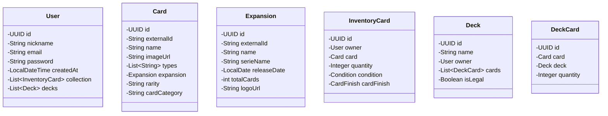

<div align="center">
  
  <h1>⚡ SilphEngine</h1>
  <p><strong>A High-Performance TCG Management & Validation Engine</strong></p>

  [](https://openjdk.org/)
  [](https://spring.io/projects/spring-boot)
  [](https://www.postgresql.org/)
  [](https://www.docker.com/)
  [](https://opensource.org/licenses/MIT)
</div>

---

## 📖 Overview & The Vision

Silph Engine is a robust backend service built with Java 25 and the Spring Boot framework. While most TCG applications are basic CRUD systems, **SilphEngine** is architected as a high-performance **Logic Hub**. It provides a solid foundation for web applications by bridging the gap between raw metadata (TCGdex API) and competitive play requirements.

Whether you are a collector tracking the "mintiness" of a rare card or a player testing deck legality, SilphEngine provides the architectural backbone to handle complex domain rules with millisecond precision, backed by a secure and scalable infrastructure.

---

## 🛠️ Technologies & Stack

This project leverages modern backend practices and tooling to ensure data integrity and non-blocking scalability:

- **Core Frameworks:** Java 25, Spring Boot, Maven
- **Persistence:** PostgreSQL, JPA (Hibernate), Flyway (Database Migrations)
- **Architecture & Performance:** Concurrency via Virtual Threads (Project Loom), MapStruct, Lombok
- **Security:** Spring Security with JWT
- **Infrastructure:** Docker & Docker Compose
- **Testing & API:** Testcontainers, SpringDoc OpenAPI (Swagger UI), Thymeleaf

---

## 🏛️ Engineering & Design Philosophy

As a developer focused on high-performance systems, I built SilphEngine with specific architectural patterns:

### 1. The Surrogate-Business Key Pattern
We utilize internal **UUIDs** for all relational persistence. This decouples our domain logic from external **TCGdex identifiers** (`externalId`). If the external API changes its data format, our internal deck-building history and user relations remain unaffected.

### 2. Smart Inventory Normalization (Weighted Stacking)
To avoid database bloat, SilphEngine employs a **qualitative stacking logic**. Instead of redundant rows, cards are grouped by `User` + `CardID` + `Condition` + `Finish`. Quantity updates are atomic, while state changes trigger a state migration rather than a simple increment.

---

## 📊 System Architecture (UML)



---

## ✨ Core Features

- **Advanced Deck Builder:** Construct decks with a 60-card limit and 4-copy rule validation.
- **Granular Inventory Tracking:** Track assets by quality (Mint to Poor) and finish (Holo, Reverse, Normal).
- **Silph Importer:** Automated service that enriches API data with expansion series and release dates.
- **Security & Database Integrity:** Robust JWT authentication and Flyway-managed schema migrations.

---

## 📚 API Documentation

The project uses SpringDoc to generate OpenAPI 3.0 documentation. Once the application is running, you can explore the endpoints, view schemas, and test the API directly through the Swagger UI at:

[http://localhost:8080/swagger-ui.html](http://localhost:8080/swagger-ui.html)

---

## 🚀 Getting Started

Silph Engine is fully containerized. You do not need to install Java or Maven on your host machine to run or build the application.

### Option A: Quick Start (Zero-Config via GitHub Packages)
The fastest way to test the API is by using the pre-built Docker image automatically generated by our CI/CD pipeline.

1. **Create a `docker-compose.yml` file** in an empty directory:
```yaml
   services:
     db:
       image: postgres:17-alpine
       container_name: silph-engine-db
       restart: always
       environment:
         POSTGRES_USER: dev_user
         POSTGRES_PASSWORD: dev_password
         POSTGRES_DB: silphengine_db
       ports:
         - "5433:5432"
       volumes:
         - postgres_data:/var/lib/postgresql/data

     app:
       image: ghcr.io/cadimodev/silph-engine:latest
       container_name: silph-engine-api
       restart: always
       ports:
         - "8080:8080"
       environment:
         - DB_PORT=5432
         - DB_NAME=silphengine_db
         - DB_USERNAME=dev_user
         - DB_PASSWORD=dev_password
         - JWT_SECRET_KEY=B8a90mvet9GHVEyhRoNzMH4u9gJObOzFBkz12PS4wds=
         - SPRING_DATASOURCE_URL=jdbc:postgresql://db:5432/silphengine_db
       depends_on:
         - db

   volumes:
     postgres_data:
   ```

2. **Start the environment:**
```bash
   docker compose up -d
   ```

### Option B: Local Development (Build from Source)
If you want to review the code or contribute, the project uses a multi-stage Dockerfile that handles all Maven dependencies and compilation securely within the container.

1. **Clone the repository:**
```bash
   git clone [https://github.com/Cadimodev/SilphEngine.git](https://github.com/Cadimodev/SilphEngine.git)
   cd SilphEngine
   ```

2. **Build and launch:**
```bash
   docker compose up --build
   ```

<div align="center">
  <sub>Developed by <a href="https://github.com/Cadimodev">Cadimodev</a> - 2026</sub>
</div>
